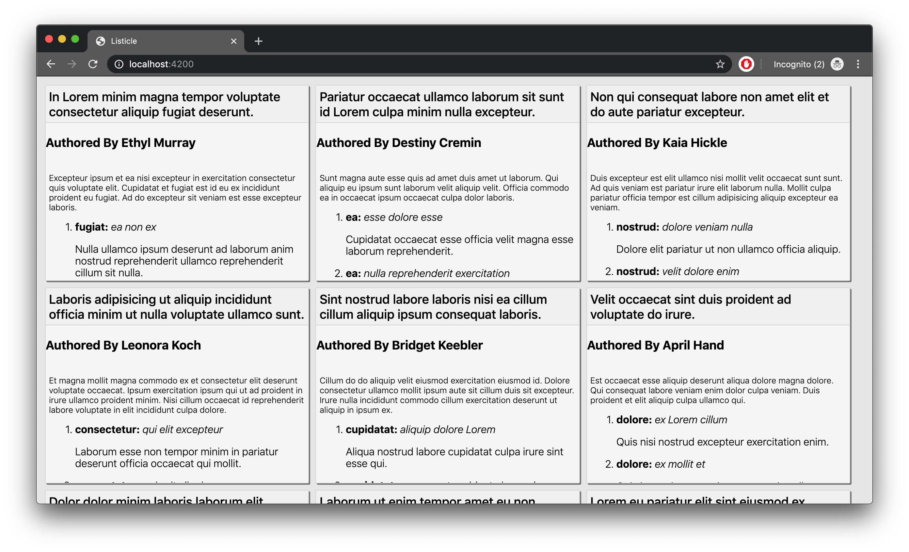
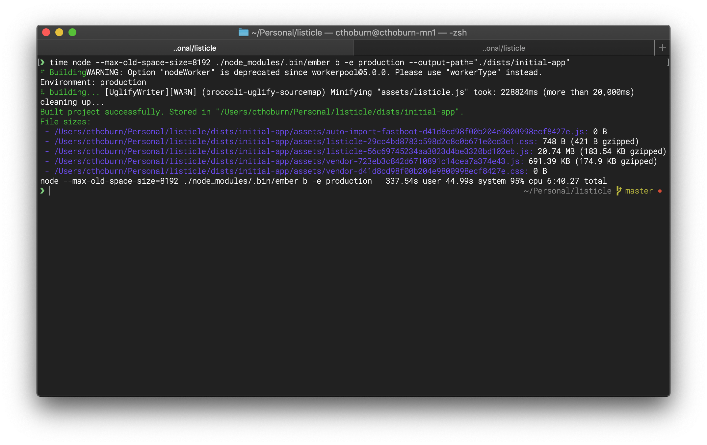
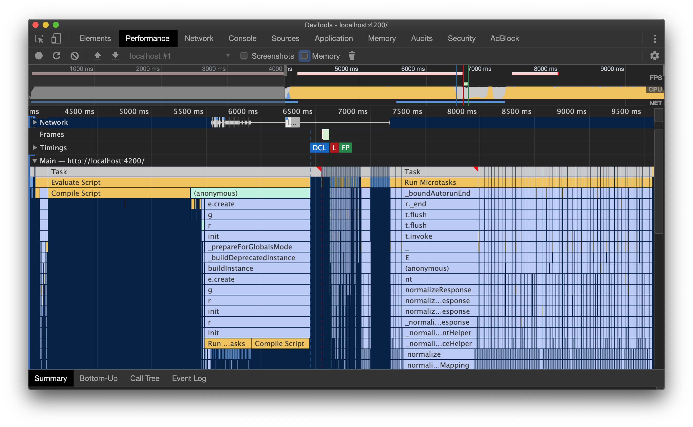

# Optimizing your App with EmberData (Part 1)

**_Welcome!_**

Over the next few weeks we are going to build an application using EmberData and optimize it. The application we are building is called **Listicle**. Listicle is a deceptively simple app presenting many commonly seen data structures. It is intentionally designed to incorporate some of the worst performance scenarios that applications routinely encounter.

We're building Listicle as a starting point. We're going to start with an app with abysmal performance, and iterate until we have the same app with great performance. This series is for beginner and experts alike, whether you build applications with Ember, or not. Whether you like EmberData, and especially _if not._

**_EmberData Crash Course_**

If you've never used EmberData before, I'd recommend starting with learning a bit about the architecture and history from my presentation at [EmberFest 2019](https://www.youtube.com/watch?v=zbqbsOyLM30&list=PLN4SpDLOSVkT0e094BZhGkUnf2WBF09xx&index=23&t=0s). You can also read through the [Guides](https://guides.emberjs.com/release/models/).

**_Our Application_**

**Listicle** is an application full of Top 20 lists for you to read, and the simple setup of a feed to scroll through available lists. As the name suggests, each list has 20 items. And of course, our lists are created by our wonderful staff of authors.

Let's look at how we model `Author`, `List` and `Item`.

```js
// models/author.js
import Model, { attr, hasMany } from '@ember-data/model';

export default class Author extends Model {
  @attr name;
  @attr profileImageUrl;
  @hasMany('list', { async: true, inverse: 'author' })
  lists;
}

// models/list.js
import Model, { attr, hasMany } from '@ember-data/model';

export default class List extends Model {
  @attr title;
  @hasMany('item', { async: true, inverse: 'list' })
  items;
  @belongsTo('author', { async: true, inverse: 'lists' })
  author;
}

//models/item.js
import Model, { attr, belongsTo, hasMany } from '@ember-data/model';

export default class Item extends Model {
  @attr description;
  @belongsTo('list', { async: true, inverse: 'items' })
  list;
  @hasMany('facet', { async: true, polymorphic: true, inverse: 'item' })
  facets;
}
```

You'll notice that each item additionally has **facets** (the reasons why this item is great!). In Listicle, every item included on a list has 5 characteristics that make it so great!

Because our Top 20 lists could be anything, facets are [polymorphic](https://en.wikipedia.org/wiki/Subtyping): each item having its own type of facets with their own unique properties.

```js

// models/facet.js
import Model, { attr, belongsTo } from '@ember-data/model';

// The base class for our polymorphic Facets
export default class Facet extends Model {
  @attr fieldName; // fieldName specifies the key of a polymorphic attr
  @belongsTo('item', { async: true, inverse: 'facets' })
  item;
}

// models/item1-facet.js
import { attr } from '@ember-data/model';
import Facet from './facet';

// All of our facets follow this convention
/*
export default Item<N>Facet extends Facet {
  @attr [fieldName];
}
*/
// So if the value of `fieldName` were color
export default Item1Facet extends Facet {
  @attr color;
}
```

> Note: Yes this Facet could be modeled without polymorphism by having a generic `value` attr. But this form of polymorphism is currently fairly common and more importantly "real" applications often have dozens to thousands of models. This setup gives us a convenient way of exploring data at both large and small scales.

One final note on our initial design. **We're going to create an [Adapter](https://api.emberjs.com/ember-data/3.14/modules/@ember-data%2Fadapter) and a [Serializer](https://api.emberjs.com/ember-data/3.14/modules/@ember-data%2Fserializer) for every single Model type.** This is to mirror a common mistake that many Ember applications make when using EmberData.

**Listicle** is conceived of as a small app-shell full of rich content lists. But what happens as our content grows? On January 1st, 2020 Listicle opens for business and begins publishing one new post a day.

By mid-July Listicle has produced 200 lists! Our site, which early on had felt snappy and fast to the users that poured into read our hottest articles has now slowed to a crawl.  And where initially as engineers we were happy and productive, now our build times have slowed to a crawl.

**_What happened?_**

Initially (ignoring authors) there was only one list to fetch, with 20 items, and 5 facets. 26 total records, 4 total Model classes, 12 total classes counting Adapters and Serializers. But as Listicle has grown we added more Models, Adapters, and Serializers to handle all these facets.

And now, 200 days in, we've got 200 lists, 4k items, 20k facets and 12009 total classes. Oof.

This may sound contrived, but this is far smaller yet still representative of what an application I write infrastructure for looked like 3 years ago. This helps to show why certain architectural choices for EmberData failed: leading too many apps to have bad performance by default. More importantly, refactoring this application will illuminate why other architectural choices in EmberData are solid, providing value to both large and small apps alike, and why we are rebuilding over the top of them. 

**_Let's get started_**

Now that we've introduced Listicle, it's time to dig in. You can follow along with the code for this series by watching the [listicle repository](https://github.com/runspired/listicle).

Most of the posts in this series won't skip over as much as this next bit will, since it's the optimizations that are interesting here and now the initial implementation itself. But before we dig in I want to give us a good sense of where we are starting from.

**_Building the app, time-travel edition_**

Our first step, generate the application we are building using Octane and Yarn.

```cli
ember new listicle --yarn -b @ember/octane-app-blueprint --no-welcome
```

Then we add our [basic app](https://github.com/runspired/listicle/commit/31fded57026b5fa12dbf2f6f7eedcf4d20d505ce) and we use [codegen](https://en.wikipedia.org/wiki/Automatic_programming) to [add our 12009 classes](https://github.com/runspired/listicle/commit/29404347955d2171d50222cd24c10f08f21e1d00) to the app (as well as fixture data to fetch for them).

One detail of the basic app implementation to not gloss over is that in our initial implementation we are loading each list individually. This is often how initial designs start, don't worry, it is not where we will end up.

**_Now, for some numbers_**

As part of our codegen commit above we added a `generate` script to `package.json`, running it will place the Adapters, Models, Serializers, and Fixtures into their proper directories. Now that we've done this, let's take a few measurements to see where we are starting from.

We will be making regular performance and asset-size checks on both our build and our app throughout this series and we will introduce the infrastructure we will use for that in one of our next posts.

```cli
time node --max-old-space-size=8192 ./node_modules/.bin/ember b -e production --output-path="./dists/initial-app"
```

Above, we are using `time` to get an accurate length for how long doing
this build is going to take. We are also manually invoking the `ember`
command with `node` so that we can allocate more memory for `node` to use
as otherwise (hint) this build will be so big it will fail. Finally, we are saving the built assets into a special `dists` directory which we will check into source control.

Throughout this series, we will commit in the `dists` from various check-points so that we can compare them quickly later both with tooling and manually.

If you clone the [listicle repo](https://github.com/runspired/listicle) and run `yarn install`, you can serve these assets to do your own perf exploration by running the following command and then navigating your web browser of choice to `localhost:4200`:

```cli
ember s --path="./dists/initial-app"
```

Here's a screenshot of our gorgeous app.



After several minutes, our build completes, let's take a look.



Some stats:

- Our build took over 3.5 minutes
- Our app.js file is 20.74 Mb but compresses to 183.5 Kb
- Our vendor.js file is 690 Kb but compresses to 174.9 Kb

Note I am not sure what the compression algorithm used or settings are here, later when we implement asset-size monitoring we will use [Brotli](https://en.wikipedia.org/wiki/Brotli) with compression set to Max (11).

What does this translate to in app performance? I took a quick profile of a page load to see.



Some initial reactions are:

- Eyeballing, we look to be spending 30% of our time or more compiling code
- Normalization looks to be about 20% of our time
- Each network response (200 of them) spends a good chunk of time getting processed afterwards.
- There is a lot of data related costs being paid in the middle of our long-yellow-snail of rendering.

Feel free to pull down the repo and serve up the app to poke around a timeline and see if you can spot these things. They are areas we will be looking to optimize over the course of this series. I'd recommend putting your browser in incognito mode and disabling all extensions before doing any performance profiling. Almost every extension has some negative effect on performance, and my own extensions (a few ad blockers and the Ember inspector) decreased the performance here by nearly 50% for me.

One final measurement before we go.


Some notes:

- This particular render took about 6 seconds. (There's also a few extra seconds from a delay with the profiler attaching)
- Our JS Heap Size for memory is 500 Mb !!
- We have 57 DOM Listeners !! (We will fix this in the near future)
- We've got almost 340k DOM nodes !! (This series won't look into the benefits of [occlusion culling](https://en.wikipedia.org/wiki/Hidden-surface_determination) but we will look at the effects pagination has here)


In a future post we will setup automated performance analysis using [Tracerbench](https://github.com/TracerBench/tracerbench) to get high-fidelity benchmarks with confidence. While timeline based exploration is critical for quickly spotting problem spots, it isn't a great tool for knowing if we've improved them or not except when the improvement is very large (and thus easier to observe).

**In my next post,** we'll look closer at the mock API produced by the codegen and explore the fixture data it returns.

In the mean time, you can learn more about the architecture of EmberData from my presentation at [EmberFest 2019](https://www.youtube.com/watch?v=zbqbsOyLM30&list=PLN4SpDLOSVkT0e094BZhGkUnf2WBF09xx&index=23&t=0s)!
